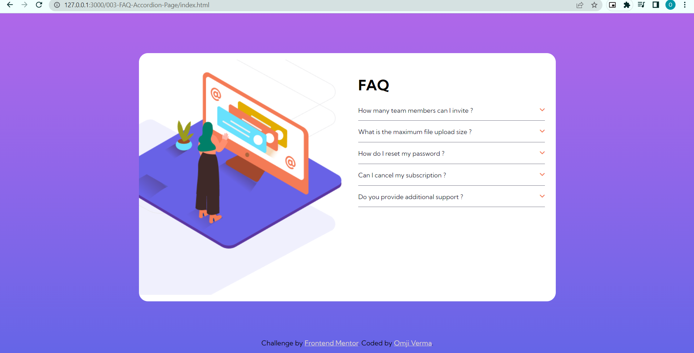

# Frontend Mentor - FAQ accordion card solution

This is a solution to the [FAQ accordion card challenge on Frontend Mentor]

## Table of contents

- [Frontend Mentor - FAQ accordion card solution](#frontend-mentor---faq-accordion-card-solution)
  - [Table of contents](#table-of-contents)
  - [Overview](#overview)
    - [The challenge](#the-challenge)
    - [Screenshot](#screenshot)
    - [Links](#links)
  - [My process](#my-process)
    - [Built with](#built-with)
    - [What I learned](#what-i-learned)
  - [Author](#author)


## Overview

### The challenge

Users should be able to:
- View the optimal layout for the component depending on their device's screen size
- Hide/Show the answer to a question when the question is clicked

### Screenshot




### Links

- Live Site URL: [Live Site URL ](https://cute-sherbet-a3008b.netlify.app/)

## My process

### Built with

- HTML 5
- CSS
- Flexbox
- CSS Grid
- Fontawesome
- javascript


### What I learned
- Grid
- Image Positioning
- Adding and Removing class with js
- Animation with css


```html
<!DOCTYPE html>
<html lang="en">
<head>
  <meta charset="UTF-8">
  <meta name="viewport" content="width=device-width, initial-scale=1.0"> <!-- displays site properly based on user's device -->
  <!-- Favicon -->
  <link rel="icon" type="image/png" sizes="32x32" href="./images/favicon-32x32.png">
  <title>Frontend Mentor | FAQ Accordion Card</title>
  <!-- Style -->
  <link rel="stylesheet" href="style.css">
  <!-- Font Awesome -->
  <link rel="stylesheet" href="https://cdnjs.cloudflare.com/ajax/libs/font-awesome/6.2.1/css/all.min.css" integrity="sha512-MV7K8+y+gLIBoVD59lQIYicR65iaqukzvf/nwasF0nqhPay5w/9lJmVM2hMDcnK1OnMGCdVK+iQrJ7lzPJQd1w==" crossorigin="anonymous" referrerpolicy="no-referrer" />
</head>
<body>
  <div class="container">
    <!-- Card Start -->
    <main class="card">
      <!-- Desktop Image -->
      <div class="image-section-desktop">
        
        <div class="img-overlay">
          
        </div>
      </div>
      <!-- Desktop Image End -->

      <!-- Accordion  Start -->
      <!-- Image Mobo -->
      

      <div class="accordion">
        <h1>FAQ</h1>
        <!-- Signle Accordion -->
        <div class="accordion-body">
          <a class="accordion--btn" target="acc--one">How many team members can I invite ? <i class="fa-solid fa-angle-down"></i></a>
          <div class="accordion--content" id="acc--one">
            <p>
              You can invite up to 2 additional users on the Free plan. There is no limit on 
              team members for the Premium plan.
            </p>
          </div>
        </div>
        <!-- Signle Accordion End-->

        <!-- Signle Accordion -->
        <div class="accordion-body">
          <a class="accordion--btn" target="acc--two">What is the maximum file upload size ? <i class="fa-solid fa-angle-down"></i></a>
          <div class="accordion--content" id="acc--two">
            <p>
              No more than 2GB. All files in your account must fit your allotted storage space.
            </p>
          </div>
        </div>
        <!-- Signle Accordion End-->

        <!-- Signle Accordion -->
        <div class="accordion-body">
          <a class="accordion--btn" target="acc--three">How do I reset my password ? <i class="fa-solid fa-angle-down"></i></a>
          <div class="accordion--content" id="acc--three">
            <p>
              Click “Forgot password” from the login page or “Change password” from your profile page.
              A reset link will be emailed to you.
            </p>
          </div>
        </div>
        <!-- Signle Accordion End-->

        <!-- Signle Accordion -->
        <div class="accordion-body">
          <a class="accordion--btn" target="acc--four">Can I cancel my subscription ? <i class="fa-solid fa-angle-down"></i></a>
          <div class="accordion--content" id="acc--four">
            <p>
              Yes! Send us a message and we’ll process your request no questions asked.
            </p>
          </div>
        </div>
        <!-- Signle Accordion End-->

        <!-- Signle Accordion -->
        <div class="accordion-body">
          <a class="accordion--btn" target="acc--five">Do you provide additional support ? <i class="fa-solid fa-angle-down"></i></a>
          <div class="accordion--content" id="acc--five">
            <p>
              Chat and email support is available 24/7. Phone lines are open during normal business hours.
            </p>
          </div>
        </div>
        <!--  Signle Accordion End-->
      </div>
      <!-- Accordion End -->
    </main>
    <!-- Card End -->
  </div>

  <!-- Attribution start -->
  <div class="attribution">
    Challenge by <a href="https://www.frontendmentor.io?ref=challenge" target="_blank">Frontend Mentor</a>. 
    Coded by <a href="https://www.frontendmentor.io/profile/omjiverma" target="_blank">Omji Verma</a>.
  </div>
  <!-- Attribution start -->

  <script src="./app.js"></script>
</body>
</html>
```
```css
/* Fonts Kumbh Sans*/
@import url('https://fonts.googleapis.com/css2?family=Kumbh+Sans:wght@400;700&display=swap');

/*Colors */
:root{
    --dark-blue: #1d1e35;
    --soft-red: #f47c57;
    --grayish-blue: #e7e7e9;
    --dark-grayish-blue: #787887;
    --light-grayish-blue: #e7e7e9;
    --background-gradient: linear-gradient(to bottom, #af67e9, #9f67e9, #8d66e9, #7a66e8, #6565e7);
}

/* 
=================
Setting Defaults
=================
*/
body{
    padding: 5px 0;
    margin: 0;
    box-sizing: border-box;
    font-family: 'Kumbh Sans', sans-serif;
    background: linear-gradient(to bottom, #af67e9, #9f67e9, #8d66e9, #7a66e8, #6565e7);;
    background-attachment: fixed;
}

/* 
==================
Main Container
==================
 */
.container{
    width: 60vw;
    height: 95vh;
    margin-left: auto;
    margin-right: auto;
    display: flex;
    align-items: center;
    
}

/* 
=====================
Card Styling
=====================
*/
.card{
    width: 100%;
    height: 550px;
    background-color: #fff;
    border-radius: 20px;
    display: grid;
    grid-template-columns: 1fr 1fr;
}
/* Image for small devices */
.mobo-img{
    display: none;
}
.image-section-desktop{
    margin: 0;
    height: 100%;
    position: relative;
    display: flex;
    align-items: center;
}
.image-section-desktop > img{
    width: 100%;
    height: auto;
}
.img-overlay{
    width: 100%;
    height: auto;
    position: absolute;
    display: flex;
    align-items: center;
}
.img-overlay > img{
    margin-left: calc(-25%);
    width: 50%;

}
/* Media Query for Container */
@media only screen and (max-width: 980px) {
    .container{
        width: 80vw;
    }
    .card{
        grid-template-columns: 1fr;
        height: 470px
    }
    .image-section-desktop{
        display: none;
    }
    .mobo-img{
        display: block;
        width: 200px;
        margin-top: -6.5rem;
        margin-bottom: 0px;
        margin-left: auto;
        margin-right: auto;
    }

  }

/* 
=============================
Accordion Styling Start Here
=============================
*/
.accordion{
    margin: 30px 24px;
    overflow: hidden;
}
.accordion-body{
    margin: 10px 0;
    padding-bottom: 8px;
    color: var(--dark-blue);
    border-bottom: 1px solid var(--dark-grayish-blue);
}
/* Accordion Button */
.accordion--btn{
    font-size: 14px;
    display: block;
    padding: 6px 0;
} 
/* Icon Styling inside Button */
.accordion--btn > i{
    padding: 20px auto;
    margin: auto 0;
    float: right;
    color: var(--soft-red);
    transform: rotate(0deg);
    transition: transform ease 0.5s;
}

/* Accordion Button Active State */
.accordion--btn--active{
    font-weight: 600;
    transition: ease 0.4s;
}

/* Accordion Button icon Active State */
.accordion--btn--active > i{
    transform: rotate(180deg);
    transition: ease 0.5s;
}

/* According Content */
.accordion--content{
    overflow: hidden;
    height: 0;
    transition: ease 0.5s;
}
.accordion--content > p{
    font-size: 14px;
    margin: 0 0;
}
@media only screen and (max-width: 980px) {
    .accordion{
        margin-top: 0;
    }
    .accordion > h1{
        margin-top: 0;
        text-align: center;
    }
  }


/* 
==============
Attribution 
==============
*/
.attribution { font-size: 15px; text-align: center; }
.attribution a { color: hsl(6, 13%, 84%) }
```
```js
// Selecting all buttons
const accBtns = document.querySelectorAll(".accordion--btn")
// Adding Event Listeners to each button
accBtns.forEach(accBtn => {
  accBtn.addEventListener('click', (event) => {
    // Toggling class with click
    accBtn.classList.toggle("accordion--btn--active")
    // Selecting Accordion Content bases on the button clicked
    const accContent = document.querySelector(`#${accBtn.target}`)
    // Changing height of accordion-content based on condtion
    if(accBtn.classList.contains("accordion--btn--active")){
      accContent.style.height = accContent.scrollHeight + 'px'
    }
    else{
      accContent.style.height = 0;
    }
  })
});
```


## Author

- Website - [Omji Verma](https://www.github.com/omjiverma)
- Frontend Mentor - [@omjiverma](https://www.frontendmentor.io/profile/yourusername)


