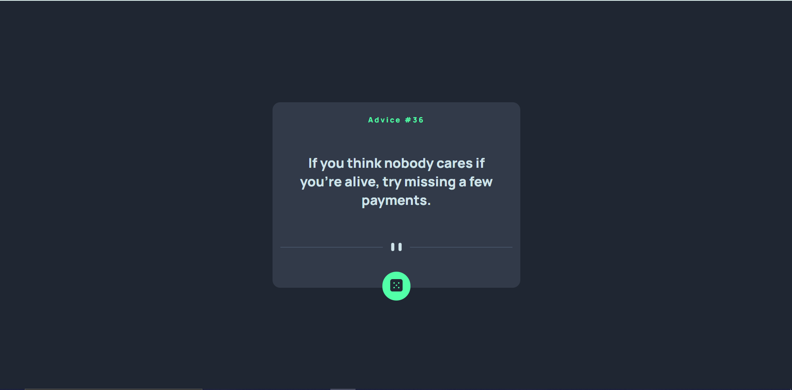
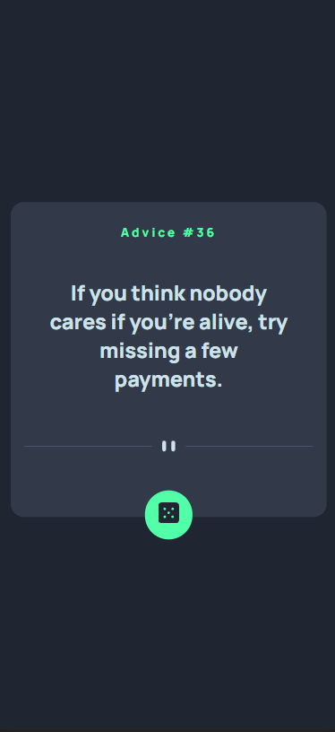

# Frontend Mentor - Advice generator app solution

This is a solution to the [Advice generator app challenge on Frontend Mentor](https://www.frontendmentor.io/challenges/advice-generator-app-QdUG-13db).

## Table of contents

- [Frontend Mentor - Advice generator app solution](#frontend-mentor---advice-generator-app-solution)
  - [Table of contents](#table-of-contents)
  - [Overview](#overview)
    - [The challenge](#the-challenge)
    - [Screenshot](#screenshot)
      - [Desktop Screenshot](#desktop-screenshot)
      - [Small Screen Shot](#small-screen-shot)
    - [Links](#links)
  - [My process](#my-process)
    - [Built with](#built-with)
    - [What I learned](#what-i-learned)
      - [App.js](#appjs)
  - [Author](#author)

**Note: Delete this note and update the table of contents based on what sections you keep.**

## Overview

### The challenge

Users should be able to:

- View the optimal layout for the app depending on their device's screen size
- See hover states for all interactive elements on the page
- Generate a new piece of advice by clicking the dice icon

### Screenshot

#### Desktop Screenshot 


#### Small Screen Shot 


### Links

- Live Site URL: [Live Site URL](https://vermillion-alpaca-245032.netlify.app/)

## My process

### Built with

- HTML 5
- CSS custom properties
- Flexbox
- [React](https://reactjs.org/) - JS library


### What I learned

 - React State
 - Fetching Data from api using axios

To see how you can add code snippets, see below:

#### App.js
```js

  const getAdvice = () =>{
    axios.get("https://api.adviceslip.com/advice")
    .then((response) => {
      setAdvice(response.data.slip)
    })
    .catch((error) => {
      console.log(error)
    })
  }

  useEffect(() => {
    getAdvice();
  }, []);

  return (
    <div className="app">
      <div className="card">
        <h1 className="card-header">Advice #{advice.id}</h1>
        <div className='card-body'>
          <p className="card-text">
            {advice.advice}
          </p>
        </div>
        
        <button className="card-button" onClick = {getAdvice} ></button>
      </div>
    </div>
  );
}

export default App;
```
```css
:root{
  --light-cyan: hsl(193, 38%, 86%);
  --neon-green: hsl(150, 100%, 66%);
  --grayish-Blue: hsl(217, 19%, 38%);
  --dark-grayish-blue: hsl(217, 19%, 24%);
  --dark-blue: hsl(218, 23%, 16%);
}
/* Font */

@import url('https://fonts.googleapis.com/css2?family=Manrope:wght@800&display=swap');
/* Body */
body{
  margin: 0;
  padding: 0;
  box-sizing: border-box;
  background-color: var(--dark-blue);
  font-family: 'Manrope', sans-serif;
}

.app{
  overflow: hidden;
  height: 100vh;
  width: 100vw;
  display: flex;
  justify-content: center;
  align-items: center;
}
/* Card Styling */
.card{
  background-color: var(--dark-grayish-blue);
  width: 450px;
  height: 330px;
  border-radius: 15px;
  padding: 15px;
}
.card-header{
  color: var(--neon-green);
  font-size: 14px;
  letter-spacing: 3px;
  text-align: center;
}
.card-text{
  margin: 25px 25px;
  font-size: 26px;
  color: var(--light-cyan);
  text-align: center;
}
.card-body{
  height: 200px;
  display: flex;
  align-items: center;
}
.desktop-divider{
  width: 100%;
  display: block;
  margin: 20px auto 10px auto;
}
.card-button{
  background-color: var(--neon-green);
  padding: 14px 15px;
  border-radius: 60px;
  border:0;
  display: block;
  margin-left: auto;
  margin-right: auto;
  margin-top: 40px;
}

.card-button:hover{
  box-shadow: 0px 1px 50px 2px var(--neon-green);
  transition: ease 0.2s;
}

/* Small Screen */
@media only screen and (max-width: 600px) {
  .card{
    width: 85vw;
  }
  .card-text{
    font-size: 24px;
  }
  .card-button{
    margin-top: 45px;
  }
}
}
```

## Author
- Frontend Mentor - [@omjiverma](https://www.frontendmentor.io/profile/omjiverma)
- Linkedin - [@omjiverma](https://www.linkedin.com/in/omjiverma)

